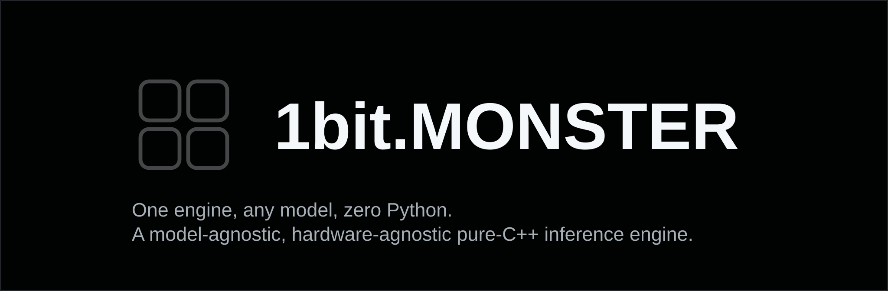

<div align="center">



[](https://github.com/1bit-MONSTER/1bit-MONSTER/actions/workflows/ci.yml)
[](LICENSE)

**[Website](https://1bit.monster)** · **[Community (Fluxer)](https://fluxer.gg/7wqCREKi)** · **[Join Discord](https://discord.gg/Qy38d4Xu2h)** · **[Docs](docs/README.md)** · **[Model families](docs/model-families/README.md)** · **[Benchmarks](docs/wiki/performance.md)** · **[JARVIS](docs/jarvis.md)** · **[The story](docs/journey.md)** · **[Roadmap](docs/guides/roadmap.md)**

pure C++23 · no Python · MIT

</div>

---

**One engine. Any model. Zero Python.**

A pure-C++23 inference engine that runs 100% of HuggingFace's text-generation checkpoints on NPU, GPU, or CPU — with the Lemonade SDK side by side, in sync with upstream.

## Quick start

```bash
git clone https://github.com/1bit-MONSTER/1bit-MONSTER
cd 1bit-MONSTER && cmake -B build && cmake --build build
./build/1bit zaya -m model.1bp -p "Hello world"
```

That's the whole install. No runtime, no virtualenv, no Python.

## For the real nerds

All the technical stuff lives in the docs and wiki:

- **[Docs index](docs/README.md)** · **[Getting started](docs/guides/getting-started.md)** · **[Build guide](docs/guides/building.md)**
- **Deep dives:** [architecture](docs/guides/architecture.md) · [model families](docs/model-families/README.md) · [benchmarks](docs/wiki/performance.md) · [Lemonade compat](docs/guides/Lemonade-Compat.md) · [JARVIS](docs/jarvis.md) · [The Mesh](docs/mesh-protocol.md) · [the full journey](docs/journey.md)

## Community

- **Discord** (community support & hangout) → https://discord.gg/Qy38d4Xu2h
- **Fluxer** (official support) → https://fluxer.gg/7wqCREKi
- **Issues & feature requests** → https://github.com/1bit-MONSTER/1bit-MONSTER/issues

## License

MIT — do whatever you want.
